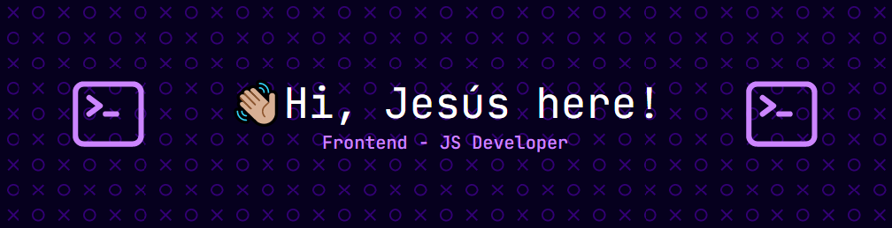

# 
I'm a Frontend Developer, code & tech apasionated, and a forever student.
- *🌱 Always learning about Web Development.*
- 💬 Ask me about anything, I'm always willing to help others🤗.
- 📫 How to reach me: **jesus.borrero.fernandez@gmail.com**
- 📎 [My Complete Resume](./assets/JesusBorreroCV.pdf)

## 🚀My Projects
I love putting into practice my knowledge and skills while developing useful/fun projects by myself. Here are the ones I consider more relevant.

  
  
  

## 👨🏻‍💻My Tech Stack
| Languages | Frontend | Backend |
| --------- | -------- | ------- |
|   |     |   |

| DBs | Tools |
| --- | ----- |
|  |     |

## 📊My Stats

  
  

## 📫Connect with me

  

